

## **时间线**

2025-06-20 抵达慕尼黑开始倒时差

2025-06-21 - 2025-06-22 畅游慕尼黑市中心及各种公园

2025-06-23 - 2025-06-26 正式开会@ACNS 2025

2025-06-27 回上海

## **正篇**

这次参加的ACNS（Applied Cryptography and Network Security）2025会议也是我参加的第一次会议，整体体验非常不错。无论是会议的组织形式还是与领域内顶尖学者的交流，都给我留下了深刻的印象。

在第一天去报道的时候，我由于德国电车晚点（加上肠胃的时差还在国内，早饭一顿狂吃，吃了很久（国内其实是午饭了）），最终卡点赶到会场，赶上了 Opening Remarks。不过发现后面迟到的人非常多，看来欧洲人是真的很松弛（虽然可能迟到不全是欧洲人）。

本次ACNS 2025 投稿数量为 241 篇，录用 55 篇，接受率为22.8%。

然后第一个汇报的工作 Algebraic Zero Knowledge Contingent Payment 就觉得挺有意思的，为了提高交易的隐私性，作者采用零知识证明的方案，允许卖家在不公布商品内容的情况下卖出商品，然后买家也是真的支付之后才会得到商品。并且这个操作是一个原子操作，保证了交易的可靠性。不过这个方案通信开销稍微大为83 KB，不过链上的存储开销只有128B。

后面又听了一会儿非常理论的报告之后就到了吃午饭的时间，这顿饭虽然看着很平淡，但是吃着挺好吃（比我当时吃过的外面的饭好吃）。

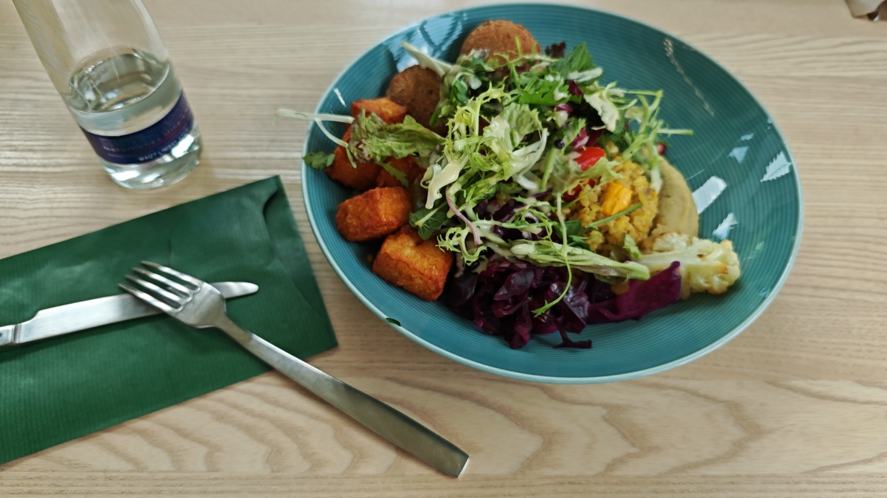

在吃饭期间认识了一位在加拿大读博的同学和一位印度的小哥，互相了解了研究方向之后发现都不太一样，于是就大家就开始了近期旅游心得的探讨、对中国电车发展的感慨，以及对我们居然不能使用ChatGPT表示震惊。（印度的口音确实还不太适应，交流起来存在些许困难）

在6月25号的时候开始参加 ACNS-SCI 2025 workshop，由中科大的 Wei Wang 老师代替Workshop Chair——中科大的 Jingqiang Lin 老师进行Opening Remarks。随后迎来的重量级的嘉宾，Spectre & Meltdown 作者，Daniel Gruss 教授做 Keynote 报告。由于 Daniel 教授名声的加持，小小的Workshop报告厅里挤满了人（Daniel 教授报告结束后人数就寥寥无几了）。

Daniel教授首先系统梳理了侧信道攻击领域的研究脉络，并分享了自己在博士阶段的探索历程。他回忆道，在他读博期间，许多看似显而易见的突破点（low-hanging fruits）基本都已经被前人发掘完，这曾让他一度陷入研究方向选择的困惑。然而，通过持续深耕系统、架构的底层机制，并与团队开展深度头脑风暴，他们最终也突破了一些认知局限，在侧信道攻防领域取得了一系列创新性成果。

在会后有幸跟Daniel教授，Wei Wang教授以及Yangguang Tian教授进行了简单的交流。分享了对博士生科研能力培养的看法，将其概括为三个阶段：初期要能够把导师提供的方向和想法做好（即使你可能没有那么认同这个方向或者idea），甚至这个过程中可能有很多问题是导师一起帮忙解决实现，这是了解科研游戏规则的第一步；然后在积累一定经验后，尝试提出自己的研究想法，由导师帮忙修正和完善；当你有了3、4篇工作基础来之后，就需要自己具备或者开始提高主导一篇工作的能力，主导的意思是导师在这个工作中只帮忙进行故事的梳理、论文润色等工作，达到这一步就初步具备了独立科研的能力。

针对研究内容选择的问题，Daniel教授强调说，首先科研不必一开始就追求“宏大”的工作，可以从一些小问题入手，快速产出并参会交流。但需注意控制小工作的耗时，避免陷入“投入过多却收获有限”的陷阱。而针对研究内容的选择上，更多的是“问题驱动”，即现有研究的不足。

在吃中饭期间认识了同样在Workshop汇报的两位中国同学，其中一位同学很凑巧曾经也联系过郁老师。在吃饭过程中，我们一致对本次中饭的伙食质量进行了严厉的批评。

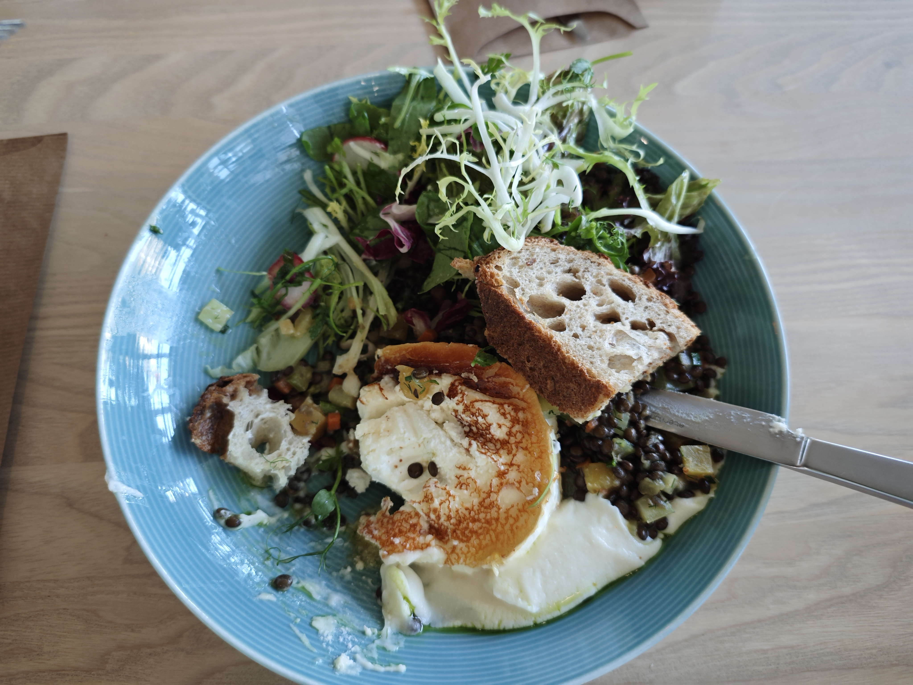

到了下午，我也上台分享了我们的工作PQMagic：Towards Secure and Efficient Post Quantum Cryptography Implementations。首先分析了当前主流的SOTA开源库中存在一系列不安全的模式，并且其效率也有很大的提升空间；然后分享了我们的改进思路；随后展示了与SOTA库的比较结果，PQMagic有着更安全的实现模式，并且效率提高接近2倍；最后与传统密码的比较中验证了PQMagic的实现性能甚至优于OpenSSL中高度优化的传统密码算法，验证了PQMagic在对后量子密码迁移工作有促进作用。没想到现场人数还比较可观，并有三位参会者提出了些许疑问，并指出希望我们的网站后续能提供一下英文的版本。

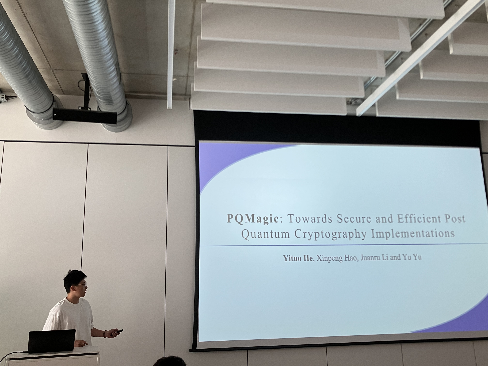

在当天晚上还参加了ACNS 2025的晚宴，伙食比中饭是好了不少。

  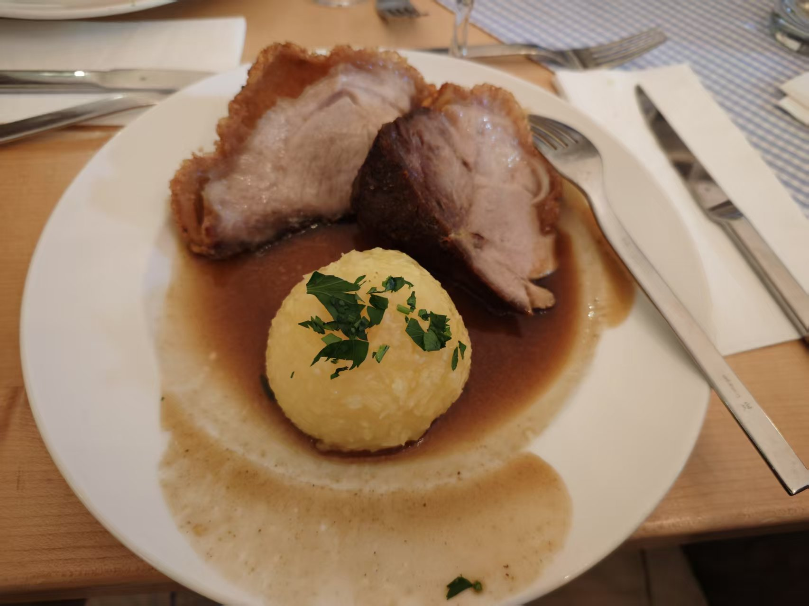
  

## **慕尼黑旅游篇**

### **1. 交通**

慕尼黑的公共交通个人感觉比较复杂。经过在xhs上仔细的调研，发现慕尼黑的公交只需要购买一次行程所在区域内的票，即可在指定时间内在这个区域通行（可以乘坐U-Bahn、S-Bahn、Tram、Bus以及区域火车）。根据我将在慕尼黑停留的时间，以及慕尼黑交通区域划分地图，我优化了一下慕尼黑公交购买的策略，得到了最便宜的购买方案——机场处于Zone 5，市中心区域为Zone M，由于开会和一般性旅游景点都集中在Zone M，因此购买一个Zone M的周票是必不可少的，但是这样没法覆盖机场和慕尼黑的通勤。但是通过研究地图可以发现，Zone M部分站点与Zone 1处于叠加态，即这些站点同时属于两个区域，因此我只需要购买Zone 1到Zone 5区域内的单次票，即可覆盖机场到混合站点的行程。而此时我又有Zone M区域的周票，因此可以继续在Zone M内畅游。由于慕尼黑公交不存在闸机，本身坐公交也是纯属自觉，因此我的购票方案不需要额外的进出站。但是还是担心会存在什么问题，因此我最终到达慕尼黑机场与当地人进行了购票思路的交流，慕尼黑人表示震惊，没有听说过这种操作，但是通过他们的二次验证认为这个方案是可行的，于是我按照这个方案购买了交通票，并安全度过了慕尼黑之行。

PS：慕尼黑买票虽然纯靠自觉，但是偶尔会有查票人员，一旦被发现没有买票或者区域不符合都将面临60欧的罚款，例如下图这个小朋友：

<!--  -->

  

### **2. 景点**

慕尼黑著名景点基本都在市中心。必去景点包括：慕尼黑老城区（玛丽亚广场，慕尼黑新/旧市政厅，各种教堂（圣母主教堂应该最为有名），谷物市场，慕尼黑王宫，英国花园（有很多人冲浪游泳），宝马世界/博物馆，安联球场（需要在晚上17点半前去可以付费进入场馆内参观），宁芬堡

慕尼黑周边必去景点包括：新天鹅堡（迪士尼城堡原型，周董结婚照打卡点），阿尔卑斯湖（新天鹅堡脚下），国王湖（没去过不知道在哪里）。去这些地方需要乘坐FlixBus或者火车，这个是另外的费用。但是据说如果交通票买的是拜仁（巴伐利亚）票，那么在整个拜仁（巴伐利亚）区域都可以畅游，但是我没有试过。

  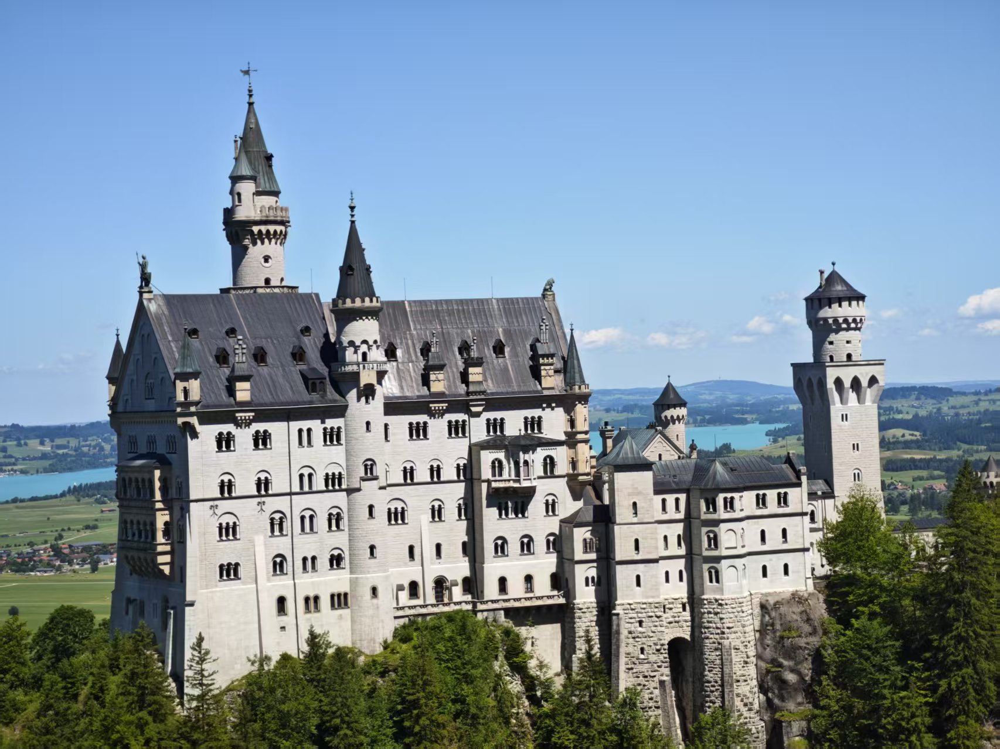
  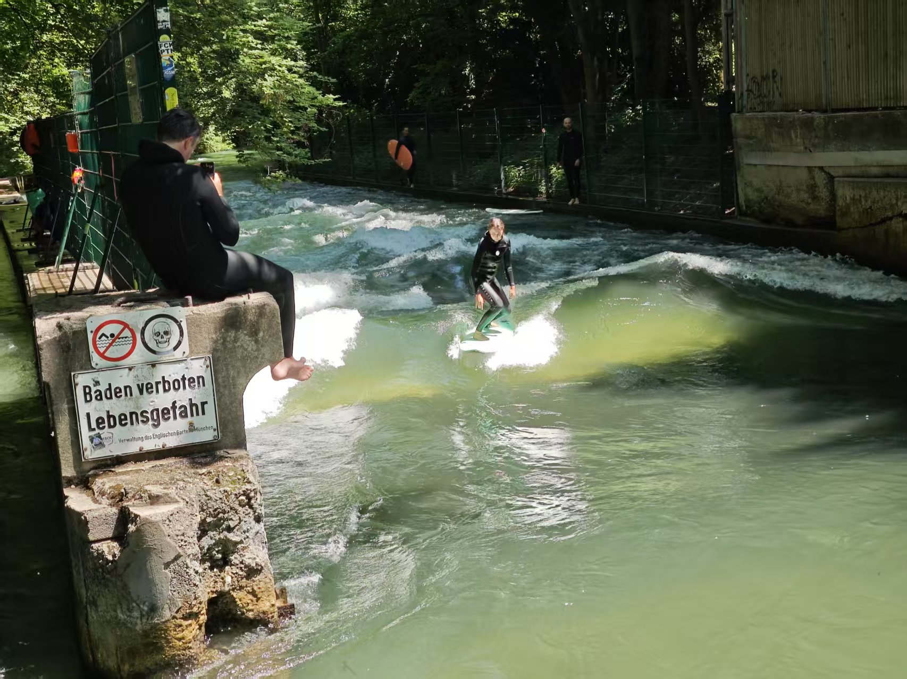
  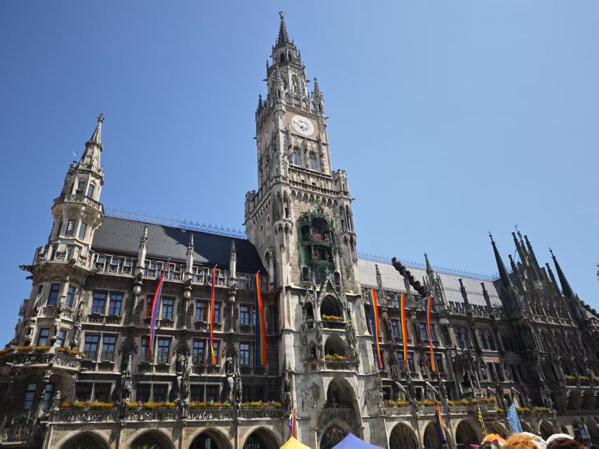
  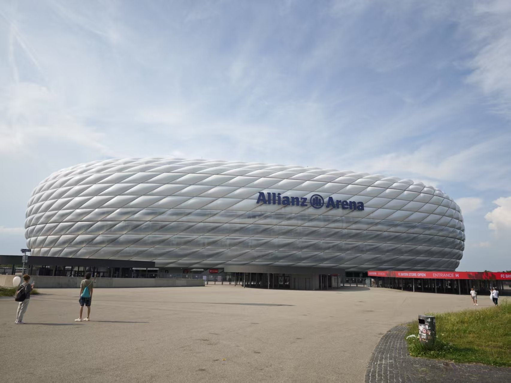

### **3. “美”食**

德国著名的猪肘（我没尝试），脆皮猪肉，烤肠，巧克力蛋糕。还遇到了一些奇怪的面条和好吃的意大利菜。

<!-- 

  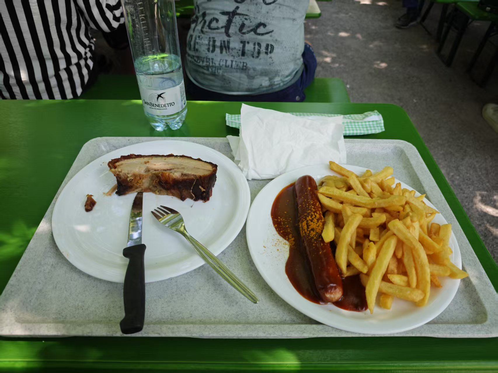
  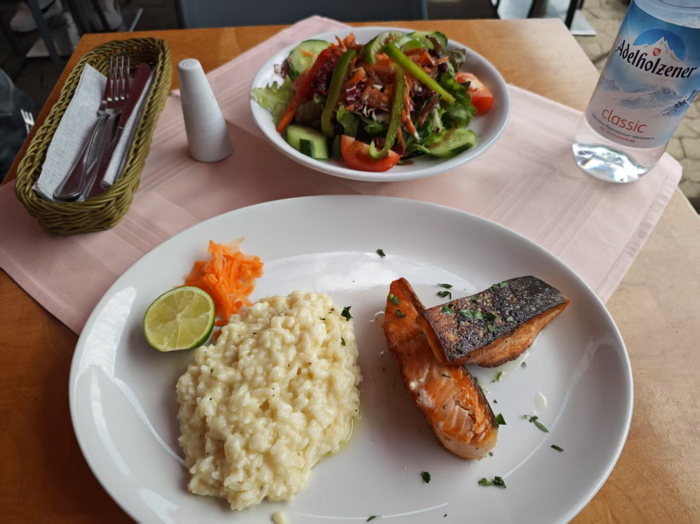

  

  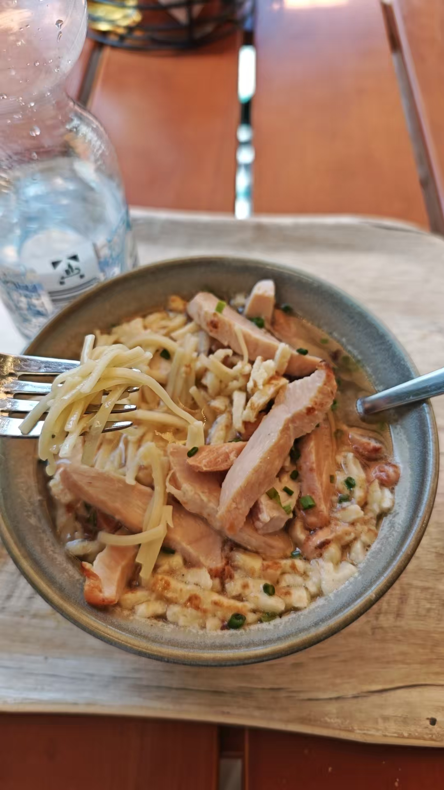
  

 -->

  
  
  

### **4. 住宿**

我住的酒店（Living Hotel am Olympiapark）还是挺不错的，坐电车15、16分钟能到会场。并且跟其他参会者交流过后发现，我这个是唯一一个免费送啤酒的酒店，其他至多只有免费的水。
