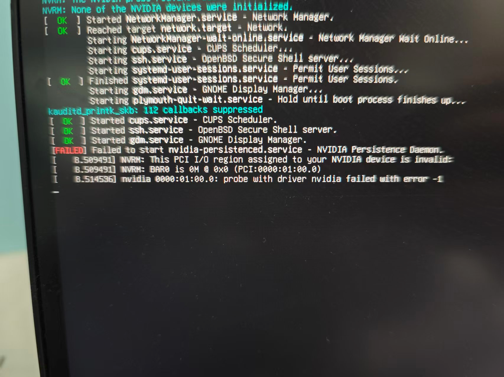



## Problem Overview

Installing NVIDIA drivers for the RTX 5060 on Debian 12/13 encountered persistent issues with kernel module loading and PCI I/O region errors.

## TL;DR;

**AI's advice:** "Have you tried turning it off and on again? Here are 10 more irrelevant solutions!"

**What actually worked:** One ancient [NVIDIA forum post](https://forums.developer.nvidia.com/t/nvrm-this-pci-i-o-region-assigned-to-your-nvidia-device-is-invalid/229899) from 2022 that AI apparently never read.

**The Real Problem:**

```text
NVRM: This PCI I/O region assigned to your NVIDIA device is invalid
NVRM: BAR0 is 0M @ 0x0 (PCI:0000:01:00.0)
```

**The Magic Fix:** Adding `pci=realloc=off` to GRUB

**Moral of the Story:**

- **Don’t rely on AI tools too much!** If it doesn’t work at first time with AI’s suggestions, it is highly recommended to conduct your own search like you always did before GPT went viral.
- Sometimes the solution is buried in a 3-year-old forum post written by someone.

## Initial Attempts

- My initial attempts are all performed on Debian 13.

### 1. Official Driver Installation

- Downloaded drivers 570.195 and 580.105 from NVIDIA.
- Installation failed with error (in `/var/log/nvidia-installer.log`):
  ```text
  ERROR: Unable to load the kernel module 'nvidia.ko'
  NVRM: This PCI I/O region assigned to your NVIDIA device is invalid
  NVRM: BAR0 is 0M @ 0x0 (PCI:0000:01:00.0)
  ```
- Asked GPT for help but nothing changed. (Tried countless solutions proposed by GPT … T_T).

### 2. APT Package Installation

- I Tried `apt install nvidia-driver nvidia-kernel-dkms` according to a [blog](https://linuxconfig.org/debian-13-nvidia-driver-installation).
- Installation completed but driver failed to load with same PCI I/O region error.
    ```bash
    root@debian:/home/haveyoutall# lsmod | grep nvidia
    root@debian:/home/haveyoutall# dmesg | grep -i nvidia | tail -n 20
    [ 22.937373] NVRM: None of the NVIDIA devices were initialized.
    [ 22.937967] nvidia-nvlink: Unregistered Nvlink Core, major device number 235
    [ 61.765540] nvidia-nvlink: Nvlink Core is being initialized, major device number 235
    [ 61.765545] NVRM: This PCI I/O region assigned to your NVIDIA device is invalid:
    [ 61.771118] nvidia 0000:01:00.0: probe with driver nvidia failed with error -1
    [ 61.771161] NVRM: The NVIDIA probe routine failed for 1 device(s).
    [ 61.771162] NVRM: None of the NVIDIA devices were initialized.
    [ 61.771719] nvidia-nvlink: Unregistered Nvlink Core, major device number 235
    [ 64.556241] nvidia-nvlink: Nvlink Core is being initialized, major device number 235
    [ 64.556248] NVRM: This PCI I/O region assigned to your NVIDIA device is invalid:
    [ 64.561945] nvidia 0000:01:00.0: probe with driver nvidia failed with error -1
    [ 64.561971] NVRM: The NVIDIA probe routine failed for 1 device(s).
    [ 64.561972] NVRM: None of the NVIDIA devices were initialized.
    [ 64.562481] nvidia-nvlink: Unregistered Nvlink Core, major device number 235
    [ 67.285039] nvidia-nvlink: Nvlink Core is being initialized, major device number 235
    [ 67.285045] NVRM: This PCI I/O region assigned to your NVIDIA device is invalid:
    [ 67.290106] nvidia 0000:01:00.0: probe with driver nvidia failed with error -1
    [ 67.290131] NVRM: The NVIDIA probe routine failed for 1 device(s).
    [ 67.290132] NVRM: None of the NVIDIA devices were initialized.
    [ 67.291037] nvidia-nvlink: Unregistered Nvlink Core, major device number 235
    ```
    
- Verified **SecureBoot** was disabled and **nouveau** was not loaded.

### 3. CUDA Repository Method

- I found another [blog](https://www.reddit.com/r/debian/comments/1nhucjl/help_how_to_install_nvidiaopen_with_dkms_on/) who suggested to following the official CUDA toolkit installation guide.
    
    > Never install Nvidia drivers using the .run script — it bypasses the system’s package manager and can easily break your setup after an update. The minimum recommended driver for your card is version 575 (or 570, if I’m not mistaken). Anything newer than that should work fine. To install them properly, you should use [Nvidia’s official CUDA repository for Debian](https://developer.nvidia.com/cuda-downloads?target_os=Linux&target_arch=x86_64&Distribution=Debian&target_version=12&target_type=deb_network). The drivers there are packaged specifically for Debian, so they won’t bypass the package manager. Alternatively, if you find the manual setup too complicated, you can use a [script](https://github.com/devleonardoamaral/debian-nvidia-installer) I made to automatically install the driver on Debian Trixie.
    > 
- So I followed [NVIDIA's official CUDA repository installation](https://developer.nvidia.com/cuda-downloads?target_os=Linux&target_arch=x86_64&Distribution=Debian&target_version=12&target_type=deb_network).
- Installed `cuda-toolkit-13-0` and `nvidia-open` packages
- Driver still failed to communicate with GPU
    
    ```bash
    root@debian:/home/haveyoutall/Downloads# nvidia-smi
    NVIDIA-SMI has failed because it couldn't communicate with the NVIDIA driver. Make sure that the latest NVIDIA driver is installed and running.
    ```
    
- After I reboot the system, I still got the same “PCI I/O region assigned” error.
    
    
    
- Then I asked the gpt again, and it told me that the problem maybe cause by compaibility between CUDA driver version and linux kernel version.
    - Debian13 using 6.12.48+deb13-amd64 is the latest version, but CUDA do not support this version yet.
    - I later discovered the reason in the NVIDIA CUDA installation guide:
        
        
        | Distribution | OS Version | Kernel |
        | --- | --- | --- |
        | … | … | … |
        | Debian 12.x | (x ≤ 12) | 6.1.148-1 |
        | … | … | … |
        
        Link: https://docs.nvidia.com/cuda/cuda-installation-guide-linux/ (Last visited: 2025-11-17)
        
    - This table suggests that official NVIDIA drivers may not yet support Debian 13 with its latest kernel.
    - Consequently, I downgraded my system to Debian 12.12 to resolve the compatibility problem.
    - **But** I still ran into **same problems** **on Debian 12** as well.

## Root Cause

- After struggling with numerous suggestions from GPT, I sought help on other forums like Stack Overflow.
- This led me to discover a thread on the [NVIDIA forum](https://forums.developer.nvidia.com/t/nvrm-this-pci-i-o-region-assigned-to-your-nvidia-device-is-invalid/229899) describing the same problem, which had an answer back to October 5, 2022.
    
    > **generix:** 
    Please set kernel parameter
    pci=realloc
    if that doesn’t fix it, try
    pci=realloc=off
    **generix**: It’s a very common problem with pci resource allocation, i.e. the memory window sizes and regions a pci device wants (BAR). Initially assigned by the bios but sometimes incorrectly/incompatible so pci=realloc enables the kernel to change the regions.
    > 
- This answer perfectly solved my problem on Debian 12. While I have not verified it on Debian 13, I believe the same method should be applicable.

## Solution All in All

The fix involved modifying kernel parameters to handle PCI resource allocation differently:

1. **Edit GRUB configuration**:
    
    ```
    sudo vim /etc/default/grub
    ```
    
2. **Add PCI reallocation parameter**:
    
    Change:
    
    ```
    GRUB_CMDLINE_LINUX_DEFAULT="quiet"
    ```
    
    To:
    
    ```
    GRUB_CMDLINE_LINUX_DEFAULT="quiet pci=realloc=off"
    ```
    
    - *Note:* If `pci=realloc=off` does not work, you can also try using `pci=realloc`. *I used `pci=realloc=off` because it worked for me but `pci=realloc` did not.*
3. **Update GRUB and reboot**:
    
    ```
    sudo update-grub
    sudo reboot
    ```
    
4. **Verify the change**:
    
    ```
    cat /proc/cmdline
    ```
    

## Final Verification

After applying the fix:

- `nvidia-smi` command works correctly
- Kernel modules load properly: `lsmod | grep nvidia`
- No more PCI I/O region errors in `dmesg`

## Key Lessons Learned

1. **Don’t rely on AI tools too much!** If it doesn’t work at first time with AI’s suggestions, it is highly recommended to conduct your own search like you always did before GPT went viral.
2. **Kernel parameters** like `pci=realloc=off` can resolve hardware detection issues. And these can be added to the `GRUB_CMDLINE_LINUX_DEFAULT` variable in the GRUB configuration file `/etc/default/grub`.