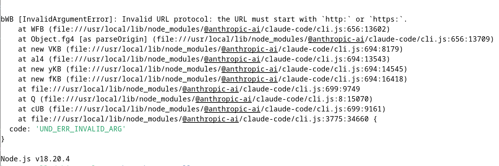
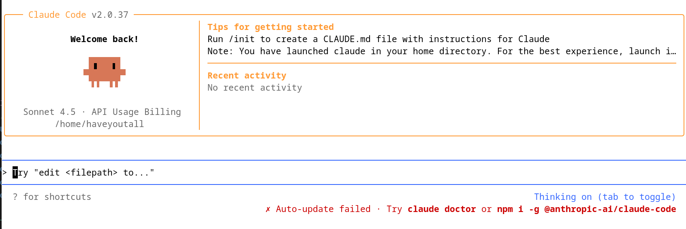



## TL;DR;

- Create a SOCKS5 tunnel with SSH (`ssh -D 11111 ...`. The `-D` flag is equivalent to setting DynamicForward in your SSH config.)

- `claude-code` **only accepts http/https proxies** (not `socks5://`)

- Run `Privoxy` locally as an HTTP proxy on `127.0.0.1:22222`, forwarding to SOCKS5 `127.0.0.1:11111`

- Point `http_proxy` and `https_proxy` to `http://127.0.0.1:22222`

## First

If you have a server, you can easily set up a SOCKS5 proxy tunnel using SSH.

1. Add an SSH host entry in `~/.ssh/config` (so your SSH commands are shorter)
    ```config
    Host proxy-server
        Hostname your.server.com # Or static ip address
        User haveyoutall
        DynamicForward 11111
        # Please checkout the official config options for other support.
    ```
2. Then you can start the SOCKS5 tunnel: `ssh -fN -M -S ~/.sshproxy.sock proxy-server`
3. If you want to stop the tunnel and cleanup the control sockt: `ssh -S ~/.sshproxy.sock -O exit proxy-server 2>/dev/null && rm -f ~/.sshproxy.sock`
4. Make it even easier (optional)
   - For convinience, you can put the start/stop commands from **step 2** and **step 3** into `.bashrc` or `.zshrc` (or whatever shell config file you use).
    > Note: Thanks AI tools for generating the following scrip lol 😄!!!!

    ```shell
    function sshproxy {
        typeset -gx _OLD_http_proxy="${http_proxy-}"
        typeset -gx _OLD_https_proxy="${https_proxy-}"
        typeset -gx _OLD_all_proxy="${all_proxy-}"
        typeset -gx _OLD_no_proxy="${no_proxy-}"

        typeset -gx _OLD_HTTP_PROXY="${HTTP_PROXY-}"
        typeset -gx _OLD_HTTPS_PROXY="${HTTPS_PROXY-}"
        typeset -gx _OLD_ALL_PROXY="${ALL_PROXY-}"
        typeset -gx _OLD_NO_PROXY="${NO_PROXY-}"

        ssh -fN -M -S ~/.sshproxy.sock proxy || return 1

        typeset -gx ALL_PROXY='socks5h://127.0.0.1:11111'
        typeset -gx all_proxy="$ALL_PROXY"
        typeset -gx HTTP_PROXY="$ALL_PROXY"
        typeset -gx http_proxy="$ALL_PROXY"
        typeset -gx HTTPS_PROXY="$ALL_PROXY"
        typeset -gx https_proxy="$ALL_PROXY"
        typeset -gx NO_PROXY='localhost,127.0.0.1,::1'
        typeset -gx no_proxy="$NO_PROXY"
    }
        
    function sshunproxy {
        ssh -S ~/.sshproxy-7800x.sock -O exit 7800x 2>/dev/null
        rm -f ~/.sshproxy-7800x.sock

        [[ -n "${_OLD_http_proxy-}"  ]] && typeset -gx http_proxy="$_OLD_http_proxy"   || unset http_proxy
        [[ -n "${_OLD_https_proxy-}" ]] && typeset -gx https_proxy="$_OLD_https_proxy" || unset https_proxy
        [[ -n "${_OLD_all_proxy-}"   ]] && typeset -gx all_proxy="$_OLD_all_proxy"     || unset all_proxy
        [[ -n "${_OLD_no_proxy-}"    ]] && typeset -gx no_proxy="$_OLD_no_proxy"       || unset no_proxy

        [[ -n "${_OLD_HTTP_PROXY-}"  ]] && typeset -gx HTTP_PROXY="$_OLD_HTTP_PROXY"   || unset HTTP_PROXY
        [[ -n "${_OLD_HTTPS_PROXY-}" ]] && typeset -gx HTTPS_PROXY="$_OLD_HTTPS_PROXY" || unset HTTPS_PROXY
        [[ -n "${_OLD_ALL_PROXY-}"   ]] && typeset -gx ALL_PROXY="$_OLD_ALL_PROXY"     || unset ALL_PROXY
        [[ -n "${_OLD_NO_PROXY-}"    ]] && typeset -gx NO_PROXY="$_OLD_NO_PROXY"       || unset NO_PROXY

        unset _OLD_http_proxy _OLD_https_proxy _OLD_all_proxy _OLD_no_proxy
        unset _OLD_HTTP_PROXY _OLD_HTTPS_PROXY _OLD_ALL_PROXY _OLD_NO_PROXY
    }
    alias sshproxystatus='lsof -iTCP:11111 -sTCP:LISTEN'
    ```
## BUT...

When I run `claude`, it doesn’t work:



It looks like `claude-code` **only supports proxies that use the http or https scheme**. A SOCKS5 proxy alone isn’t accepted.

So I used `Privoxy` as a bridge: it exposes a local HTTP proxy and forwards traffic to my SOCKS5 tunnel.

## Final Version

1. **Install Privoxy**:
    ```bash
    apt update
    apt install -y privoxy
    ```
2. **Configure Privoxy to forward http to the SOCKS5 tunnel**
   - Edit /etc/privoxy/config
        ```bash
        listen-address  127.0.0.1:22222
        forward-socks5t / 127.0.0.1:11111 .
        ```
   - `127.0.0.1:22222` is the local HTTP proxy address you’ll use.
   - `127.0.0.1:11111` is your local SOCKS5 port created by `ssh`.
3. **Restart the service**:
    ```bash
    systemctl restart privoxy
    ```
4. **Finally update your profile functions**:
    ```shell
    function sshproxy {
        typeset -gx _OLD_http_proxy="${http_proxy-}"
        typeset -gx _OLD_https_proxy="${https_proxy-}"
        typeset -gx _OLD_all_proxy="${all_proxy-}"
        typeset -gx _OLD_no_proxy="${no_proxy-}"

        typeset -gx _OLD_HTTP_PROXY="${HTTP_PROXY-}"
        typeset -gx _OLD_HTTPS_PROXY="${HTTPS_PROXY-}"
        typeset -gx _OLD_ALL_PROXY="${ALL_PROXY-}"
        typeset -gx _OLD_NO_PROXY="${NO_PROXY-}"

        ssh -fN -M -S ~/.sshproxy.sock proxy || return 1

        typeset -gx ALL_PROXY='socks5h://127.0.0.1:11111'
        typeset -gx all_proxy="$ALL_PROXY"
        
        typeset -gx HTTP_PROXY="http://127.0.0.1:22222"
        typeset -gx http_proxy="$HTTP_PROXY"
        typeset -gx HTTPS_PROXY="$HTTP_PROXY"
        typeset -gx https_proxy="$HTTP_PROXY"
        typeset -gx NO_PROXY='localhost,127.0.0.1,::1'
        typeset -gx no_proxy="$NO_PROXY"
    }
        
    function sshunproxy {
        ssh -S ~/.sshproxy-7800x.sock -O exit 7800x 2>/dev/null
        rm -f ~/.sshproxy-7800x.sock

        [[ -n "${_OLD_http_proxy-}"  ]] && typeset -gx http_proxy="$_OLD_http_proxy"   || unset http_proxy
        [[ -n "${_OLD_https_proxy-}" ]] && typeset -gx https_proxy="$_OLD_https_proxy" || unset https_proxy
        [[ -n "${_OLD_all_proxy-}"   ]] && typeset -gx all_proxy="$_OLD_all_proxy"     || unset all_proxy
        [[ -n "${_OLD_no_proxy-}"    ]] && typeset -gx no_proxy="$_OLD_no_proxy"       || unset no_proxy

        [[ -n "${_OLD_HTTP_PROXY-}"  ]] && typeset -gx HTTP_PROXY="$_OLD_HTTP_PROXY"   || unset HTTP_PROXY
        [[ -n "${_OLD_HTTPS_PROXY-}" ]] && typeset -gx HTTPS_PROXY="$_OLD_HTTPS_PROXY" || unset HTTPS_PROXY
        [[ -n "${_OLD_ALL_PROXY-}"   ]] && typeset -gx ALL_PROXY="$_OLD_ALL_PROXY"     || unset ALL_PROXY
        [[ -n "${_OLD_NO_PROXY-}"    ]] && typeset -gx NO_PROXY="$_OLD_NO_PROXY"       || unset NO_PROXY

        unset _OLD_http_proxy _OLD_https_proxy _OLD_all_proxy _OLD_no_proxy
        unset _OLD_HTTP_PROXY _OLD_HTTPS_PROXY _OLD_ALL_PROXY _OLD_NO_PROXY
    }
    alias sshproxystatus='lsof -iTCP:11111 -sTCP:LISTEN'
    ```
5. **Success**:

    