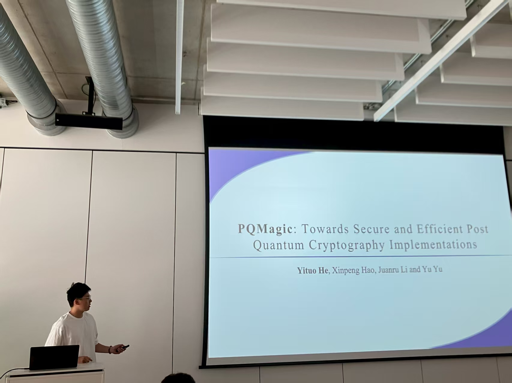
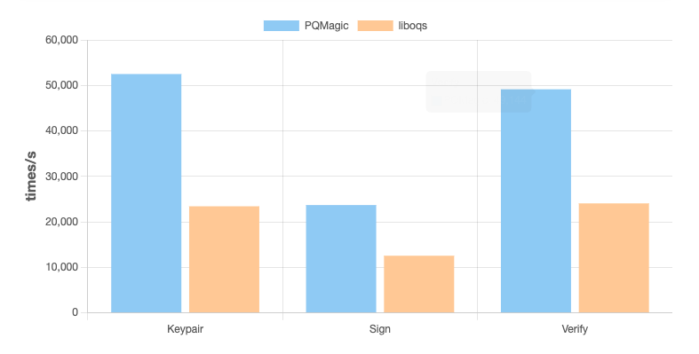
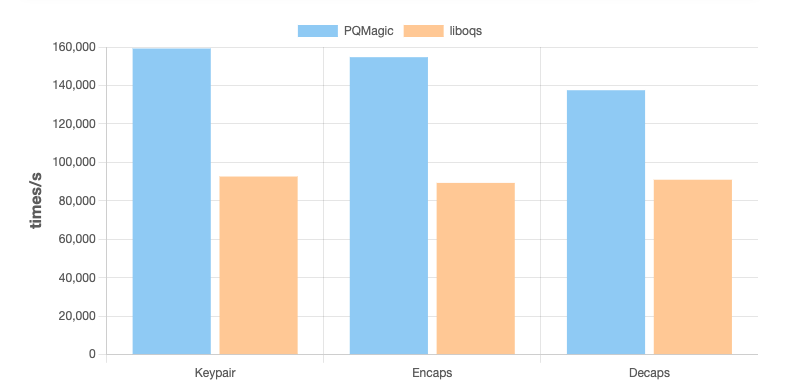



[PQMagic](https://pqcrypto.dev) is the first high-performance post-quantum cryptographic algorithm library in China. It outperforms the current leading libraries. We are honored to present this work at ACNS-SCI 2025.

PQMagic outperforms the current leading open source implementation, liboqs, with approximately a 2x improvement in performance.

### Benchmark Platform
  
  | Platform | CPU               | OS        |
  |:--------:|:-----------------:|:---------:|
  | X86      | AMD Ryzen 5 9600x  | Debian 12 |

### ML-DSA-87

  
### ML-KEM-1024

Please refer to our website (https://pqcrypto.dev/benchmarking/) to see more details about performance of PQMagic-std and PQMagic-adv.

